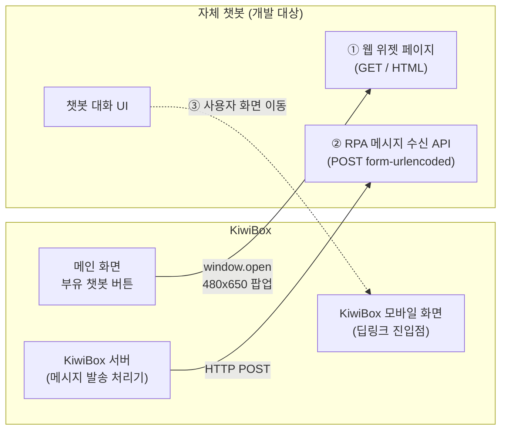

# 자체 챗봇 — KiwiBox 연동 개발자용 PRD

> 본 문서는 **KiwiBox 소스 코드에 접근할 수 없는 챗봇 개발팀**이 본 문서만으로 KiwiBox와의 연동 사양을 이해하고 자체 챗봇을 개발할 수 있도록 작성되었다.
>
> **본 작업의 방향**: 현재 KiwiBox는 외부 챗봇 **Kori**와 연동되어 운영 중이다. 본 작업은 이 연동을 끊는 것이 아니라, **동일한 인터페이스로 동작하는 자체 챗봇을 추가**하여 KiwiBox가 설정 변경만으로 자체 챗봇을 사용할 수 있도록 하는 것이다.
>
> 따라서 자체 챗봇은 **현행 Kori가 KiwiBox에 제공하고 있는 두 개의 인터페이스**(웹 위젯 URL, RPA 메시지 수신 API)를 동일하게 제공해야 한다.
>
> 본 문서는 self-contained 하다. KiwiBox 내부 구현(컨트롤러 코드, 큐 테이블 등)은 알 필요가 없다. 본 PRD가 정의하는 두 인터페이스만 구현하면 연동이 성립한다.

---

## 0. 메타데이터

- doc_id: `PRD-CHATBOT-VENDOR-001`
- 연동 상대 시스템: **KiwiBox eGov 4.2** (HR/근태 SaaS)
- 챗봇 개발팀이 제공해야 할 인터페이스: **2개**
  1. 챗봇 웹 위젯 URL
  2. RPA 메시지 수신 API
- 챗봇 개발팀이 활용할 수 있는 KiwiBox 측 인터페이스: **1개군**
  - 모바일 화면 딥링크 URL 10종 (사용자에게 KiwiBox 기능 화면을 직접 보여주기 위해 챗봇이 호출)
- 시간대: `Asia/Seoul`
- 통신 방식: HTTPS, UTF-8

---

## 1. 개요

### 1.1 작업의 위치
- KiwiBox는 이미 외부 챗봇 **Kori**와 연동되어 운영 중이다.
- 본 작업은 Kori와 동일한 인터페이스를 만족하는 **자체 챗봇을 별도 시스템으로 신규 개발**하는 것이다.
- 자체 챗봇이 완성되면 KiwiBox 운영팀은 **설정 키 두 개를 변경**하여 챗봇 대상을 Kori → 자체 챗봇으로 전환할 수 있다.
- 본 PRD는 그 "동일 인터페이스"의 정확한 사양이다.

### 1.2 인터페이스 전체 구도



- **① 웹 위젯 페이지** (챗봇 측 제공): KiwiBox 사용자가 부유 버튼을 클릭하면 별도 팝업창(480×650)으로 열리는 챗봇 UI 페이지.
- **② RPA 메시지 수신 API** (챗봇 측 제공): KiwiBox 서버가 발송할 메시지를 단건으로 POST 하는 엔드포인트.
- **③ 모바일 화면 딥링크** (KiwiBox 측 제공): 챗봇이 사용자를 KiwiBox 기능 화면(휴가신청, 결재함 등)으로 직접 이동시킬 때 사용하는 URL 10종.

### 1.3 본 PRD의 범위

| 정의함 | 정의 안 함 |
|---|---|
| 두 인터페이스의 URL/메서드/파라미터/인코딩 | 챗봇 내부 구현(데이터 모델, 화면, 응답 생성 방식 등) |
| KiwiBox가 보내는 RPA 코드/메시지 코드의 의미 | 챗봇이 사용자에게 메시지를 어떤 방식으로 노출할지 |
| 사용자 식별 키(이메일, RPA API용) 및 세션 공유 전제 | 챗봇 운영 인프라 |
| 응답 처리 정책 | — |

> 챗봇 내부 구현 방식은 본 PRD가 강제하지 않는다. 본 PRD는 KiwiBox 와의 **외부 인터페이스 계약**만 다룬다.

### 1.4 핵심 제약 (Critical Constraints)
1. **KiwiBox는 코드 수정 없이 설정 키 두 개만 바꿔서** 챗봇 대상을 전환한다. 따라서 인터페이스는 본 PRD 사양에서 **이탈하면 안 된다**.
2. **KiwiBox → 챗봇 단방향 송신**이다. 챗봇이 KiwiBox로 콜백을 보내는 인터페이스는 현재 없다.
3. **KiwiBox는 RPA API의 응답 본문을 사용하지 않는다.** 응답이 200이든 4xx이든 호출자 동작은 동일하다(현행 동작 그대로). 응답 본문 포맷은 챗봇 자율이다.

---

## 2. 용어 정의

| 용어 | 정의 |
|---|---|
| KiwiBox | HR/근태 SaaS. 본 챗봇의 호출자. |
| Kori | 현행 외부 챗봇(`chatbot.tigrison.com`). 본 PRD가 정의하는 인터페이스의 원형이다. |
| 자체 챗봇 | 본 PRD의 개발 대상. Kori와 동일 인터페이스를 가진다. |
| RPA 코드 | KiwiBox가 메시지의 종류를 식별하기 위해 보내는 코드(`HR_RPA_xxx`). |
| 메시지 코드 | KiwiBox가 업무를 분류하기 위해 보내는 코드(`TAA_xxx`). |
| `loginId` | 수신자 식별자. 평문 이메일. |
| 부유 버튼 | KiwiBox 메인 화면 우하단의 챗봇 진입 버튼. |

---

## 3. 인터페이스 ① — 챗봇 웹 위젯 URL

### 3.1 개요
KiwiBox 사용자가 메인 화면 부유 버튼을 클릭하면, KiwiBox는 챗봇 웹 페이지를 **별도 팝업창(`window.open`)으로 연다**. iframe 임베드가 아니다.

### 3.2 호출 방식 (KiwiBox 측 동작 — 변경 불가)

```javascript
window.open(
  chatbotWebUrl,           // 챗봇 측이 제공하는 URL (정적 문자열)
  'tigris-chatbot',        // 윈도우 이름 (고정)
  'width=480, height=650, menubar=no, status=no, resizeable=yes, top=..., left=...'
);
```

- 윈도우 크기: **480 × 650 픽셀** 고정.
- 화면 중앙 정렬: top/left 자동 계산.
- 동일 윈도우 이름(`tigris-chatbot`) — 이미 열려 있으면 재사용된다.
- **URL에 동적 파라미터/쿼리스트링이 추가되지 않는다.** KiwiBox는 정적 문자열로 호출한다.

### 3.3 챗봇 측 요구 사항

| 항목 | 요구 |
|---|---|
| URL 경로 | 자유. KiwiBox 운영팀에 단일 절대 URL로 제공. |
| 프로토콜 | **HTTPS 필수** |
| 응답 | HTML 페이지(또는 SPA 진입). 480×650 창에서 정상 동작 |
| 도메인 | **KiwiBox 세션 쿠키를 공유할 수 있는 동일 도메인 또는 서브도메인**으로 배포(§3.4의 세션 이어받기 전제). 쿠키 도메인 범위·SameSite 속성을 KiwiBox 운영팀과 사전 합의. |
| 브라우저 호환 | 사내 표준 브라우저(Chrome/Edge) |

### 3.4 사용자 식별 (Web Widget)
자체 챗봇(OKR 챗봇)은 **KiwiBox 로그인 세션을 그대로 이어받아 동작하는 구조**이다. 챗봇 웹 페이지는 KiwiBox 세션 쿠키를 공유하여 사용자 식별자를 확보하며, **별도의 SSO 연동·로그인 절차는 필요하지 않다**.

- 호출 URL에는 추가 파라미터·쿼리스트링이 포함되지 않는다(URL은 정적 문자열).
- 사용자 식별은 챗봇 페이지가 KiwiBox 세션 쿠키를 읽어 처리한다(세션 공유는 §3.3 도메인 요건으로 보장).
- 챗봇 페이지 로드 시 KiwiBox 세션이 유효하지 않은 경우의 처리(예: 안내 메시지 표시)는 챗봇 측 자율 설계.

### 3.5 KiwiBox 측 부유 버튼 표시 동작 (참고)
챗봇 개발과 직접 관련은 없으나 사용자 흐름 이해를 위해 명시한다:
- 버튼 위치: 화면 우하단 고정(드래그로 이동 가능).
- 버튼 크기: 80 × 60px, 둥근 모서리.
- 버튼 노출 조건: KiwiBox 내부 플래그에 의해 결정. 챗봇 개발팀은 가시성 제어에 관여하지 않는다.
- 버튼 아이콘 자산: KiwiBox 측이 보유.

---

## 4. 인터페이스 ② — RPA 메시지 수신 API

### 4.1 개요
KiwiBox 서버가 발송할 메시지를 챗봇으로 단건씩 POST 한다. 챗봇은 이 메시지를 어떻게 처리할지 자율로 정한다(본 PRD 범위 외).

### 4.2 엔드포인트

| 항목 | 값 |
|---|---|
| Method | `POST` |
| URL | 챗봇 측이 제공 (예: `https://chatbot.example.com/api/v1/rpa/messages`) |
| Content-Type | `application/x-www-form-urlencoded; charset=utf-8` |
| 인증 헤더 | **현재 KiwiBox는 인증 헤더를 보내지 않는다**. (Kori 호출 시와 동일) |
| 호출 패턴 | 단일 요청 = 단일 메시지. 단일 트리거에서 N건의 직렬 POST가 발생할 수 있음. |

### 4.3 요청 파라미터 (Body, form-urlencoded)

KiwiBox는 다음 5개 파라미터를 항상 보낸다(현행 Kori 사양과 동일).

| 파라미터 | 타입 | 의미 | 예시 |
|---|---|---|---|
| `rpaCode` | string | RPA 코드(메시지 종류 식별) | `HR_RPA_100` 또는 `HR_GO_TO_WORK` |
| `messageCode` | string | 업무 분류 코드 | `TAA_100` |
| `message` | string | 사용자에게 보일 본문(평문) | `출근체크가 필요합니다.` |
| `loginId` | string | 수신자 식별자(이메일, 평문) | `user@example.com` |
| `overtime` | string | 임시 연장 시간(분). 현재 항상 `"0"` 으로 전송됨. | `0` |

#### 4.3.1 인코딩 주의사항 (현행 동작에서 확인된 사실)

KiwiBox는 현재 파라미터 값에 **`URLEncoder`를 적용하지 않고** 직접 문자열을 결합하여 body를 만든다. 따라서:

- `message` 본문에 `&`, `=`, 공백 등이 포함될 때 표준 form-urlencoded 디코더로 정상 파싱되지 않을 수 있다.
- 한글은 UTF-8 바이트 그대로 들어온다.
- 챗봇 측은 **관용적 파싱(lenient parsing)** 또는 별도의 디코딩 가드를 권장한다.
- KiwiBox 측이 향후 `URLEncoder`를 적용하더라도 챗봇 측 정상 파싱이 깨지지 않도록 양쪽 모두 처리할 것.

#### 4.3.2 본문 길이
- `message`: KiwiBox 측에 명시적 상한 없음. 챗봇 측에서 합리적 한도(예: 4000자) 적용 권장.
- 그 외 코드/식별자: 64자 이내.

### 4.4 응답

| 항목 | 값 | 비고 |
|---|---|---|
| HTTP 상태 | `200 OK` 권장 | KiwiBox는 본문/상태를 사용하지 않는다. 어떤 코드든 호출자 동작은 동일. |
| 응답 본문 | 자유 | KiwiBox는 본문을 읽기만 하고 사용/저장하지 않는다. |

> KiwiBox가 응답을 사용하지 않는 것은 **현행 동작에서 확인된 사실**이다. 따라서 챗봇 측에서 발생한 오류를 호출자에게 전달할 수단이 없다. 챗봇 측 자체 모니터링이 유일한 가시성 수단이다.

### 4.5 알 수 없는 사용자 처리
KiwiBox가 보내는 `loginId`(이메일)가 챗봇 측에 등록되어 있지 않은 경우의 처리는 챗봇 측 정책으로 정한다(본 PRD 범위 외).

### 4.6 멱등성 / 중복 호출
- KiwiBox는 멱등 키를 보내지 않는다.
- 동일 메시지가 다시 호출될 가능성을 배제할 수 없다(KiwiBox 측 큐 처리 특성상).
- 중복 처리 방침은 챗봇 측 자율.

### 4.7 RPA 코드 명세

KiwiBox로부터 도달할 수 있는 코드 전수 목록(현행 Kori 사양 그대로):

| messageCode | rpaCode (원본) | rpaCode (KiwiBox가 별칭으로 치환하는 경우) |
|---|---|---|
| `TAA_090` | `HR_RPA_090` | `HR_GET_OFF_WORK` (특정 맥락에서 치환됨) |
| `TAA_100` | `HR_RPA_100` | `HR_GO_TO_WORK` (특정 맥락에서 치환됨) |
| `TAA_110` | `HR_RPA_110` | (별칭 없음) |
| `TAA_120` | `HR_RPA_120` | (별칭 없음) |
| `TAA_130` | `HR_RPA_130` | (별칭 없음) |
| `TAA_140` | `HR_RPA_140` | (별칭 없음) |
| `TAA_800` | `HR_RPA_800` | (별칭 없음) |

#### 4.7.1 별칭 처리 의무
챗봇은 `rpaCode` 파라미터로 위 표의 **원본 코드 또는 별칭** 둘 다 받을 수 있어야 한다. 별칭은 원본과 동일한 의미로 처리한다.

| 별칭 (KiwiBox가 보내는 형태) | 동등한 원본 코드 |
|---|---|
| `HR_GO_TO_WORK` | `HR_RPA_100` |
| `HR_GET_OFF_WORK` | `HR_RPA_090` |

#### 4.7.2 코드별 의미 (현행 Kori 명세)
- `HR_RPA_090`: 근무시간 안내 / 퇴근체크 (별칭 `HR_GET_OFF_WORK` 사용 시 퇴근 맥락)
- `HR_RPA_100`: 출근체크 + PC ON (별칭 `HR_GO_TO_WORK` 사용 시 출근 맥락)
- `HR_RPA_110`: 퇴근시간 안내
- `HR_RPA_120`: 퇴근시간 체크 — 연장 1차
- `HR_RPA_130`: 퇴근시간 체크 — 연장 2차
- `HR_RPA_140`: 퇴근시간 체크
- `HR_RPA_800`: PC 종료

> 본 의미는 KiwiBox 내부 코드 주석에 박제된 현행 Kori 명세이다. 챗봇 내부에서 코드별로 어떤 처리를 할지는 본 PRD가 정의하지 않는다.

---

## 5. 인터페이스 ③ — KiwiBox 모바일 화면 딥링크 URL (챗봇이 호출)

### 5.1 개요
KiwiBox는 챗봇이 사용자를 특정 기능 화면(휴가신청, 결재함 등)으로 직접 이동시킬 수 있도록 **모바일 화면 진입 URL 10종**을 제공한다. 챗봇 대화 흐름에서 "휴가 신청하러 가기" 같은 액션을 사용자에게 제시할 때 활용한다.

### 5.2 호출 전제 — KiwiBox 세션 내 동작
- 자체 챗봇(OKR 챗봇)은 **KiwiBox 로그인 세션을 그대로 이어받아** 호출되는 구조이다.
- 따라서 아래 URL 호출 시 **추가 인증·토큰·SSO 처리가 필요하지 않다**. 사용자의 브라우저가 KiwiBox 도메인의 세션 쿠키를 보유한 상태이면 그대로 화면이 렌더된다.
- 챗봇 측은 단순히 사용자 화면을 해당 절대 URL로 이동시키면 된다(동일 창 이동, 새 탭, 모바일 인앱 브라우저 등 — 챗봇 자율).

### 5.3 제공 URL 목록

| # | 화면 | 경로 | 절대 URL 예시 |
|---|---|---|---|
| 1 | 출퇴근 체크 (모바일 메인) | `/MobileMain.do` | `https://api.5240.cloud/MobileMain.do` |
| 2 | 휴가신청 | `/MobileLeaveAppl.do` | `https://api.5240.cloud/MobileLeaveAppl.do` |
| 3 | 연장근무신청 | `/MobileOvertimeAppl.do` | `https://api.5240.cloud/MobileOvertimeAppl.do` |
| 4 | 출장신청 | `/MobileBusinessAppl.do` | `https://api.5240.cloud/MobileBusinessAppl.do` |
| 5 | 조퇴/외출신청 | `/MobileHalfLeaveAppl.do` | `https://api.5240.cloud/MobileHalfLeaveAppl.do` |
| 6 | 출퇴근변경 | `/MobileWorkTimeChgAppl.do` | `https://api.5240.cloud/MobileWorkTimeChgAppl.do` |
| 7 | 경조휴가신청 | `/MobileConLeaveAppl.do` | `https://api.5240.cloud/MobileConLeaveAppl.do` |
| 8 | 결재함 | `/MobileApprovalBox.do` | `https://api.5240.cloud/MobileApprovalBox.do` |
| 9 | 근무일정조회 | `/MobileDclzWorkSearchCldr.do` | `https://api.5240.cloud/MobileDclzWorkSearchCldr.do` |
| 10 | 경조금신청 | `/MobileCtsmnAppl.do` | `https://api.5240.cloud/MobileCtsmnAppl.do` |

> 베이스 도메인(`https://api.5240.cloud`)은 환경에 따라 달라질 수 있으므로 KiwiBox 운영팀이 통보하는 값을 사용한다. 경로(`/Mobile*.do`)는 고정이다.

### 5.4 호출 방식
- HTTP `GET` (브라우저 내비게이션).
- 추가 쿼리 파라미터 불필요.
- 인증 헤더·토큰 불필요(세션 쿠키 의존).

### 5.5 본 인터페이스의 범위
- 챗봇은 위 URL **목록을 알고 사용자에게 진입 링크를 제공하는 것**으로 책임이 끝난다.
- 화면 내부 동작(휴가신청 폼 처리, 결재함 조회 결과 등)은 KiwiBox가 자체적으로 처리한다.
- 위 URL 외의 화면을 챗봇에서 호출해야 할 경우 KiwiBox 운영팀과 별도 협의(§11 참조).

---

## 6. 사용자 식별

### 6.1 식별 키
- **유일 식별자**: `loginId` (이메일, 평문). 이는 RPA 메시지 수신 API(§4)에 한정된 사항이다.
- 사번 등 다른 식별자는 RPA 호출에 포함되지 않는다.

### 6.2 사용자 마스터의 출처
KiwiBox는 챗봇에게 사용자 마스터를 동기화 제공하지 않는다(현행 인터페이스 기준). 챗봇 측 사용자 마스터 확보 방법은 챗봇 자율.

### 6.3 이메일 평문 전송
- 이메일은 평문으로 전송됨(URL 인코딩 미적용). TLS 외 추가 암호화 없음.
- 챗봇 로그 저장 시 PII 정책 적용 권장.

---

## 7. 인증·보안

### 7.1 RPA 수신 API 인증 (현행 사실)
- KiwiBox는 인증 헤더를 보내지 않는다(현행 Kori 호출과 동일).
- 엔드포인트가 외부에 노출되면 임의 메시지 주입 위험이 있으므로, 챗봇 측은 **최소한 IP 화이트리스트**(KiwiBox 송신 IP만 허용)로 보호할 것을 권장.
- 그 외 보안 강화(공유 비밀 헤더, mTLS 등)는 KiwiBox 운영팀과 별도 합의 시 도입 가능 — 본 PRD 범위 외.

### 7.2 웹 위젯 인증
- 챗봇 웹 페이지는 **KiwiBox 세션 쿠키를 공유하여 사용자를 식별한다**(§3.4 참조).
- 별도의 SSO·로그인 절차 불필요.
- 세션 공유 전제로 도메인 구성이 필요하다(§3.3 도메인 항목 참조).

### 7.3 전송 보안
- 모든 통신 TLS 1.2 이상.

### 7.4 입력 검증 (권장)
- `rpaCode`: §4.7 표 + 별칭 외 값에 대한 처리 정책을 챗봇 측이 정의.
- `message`: 길이 상한 적용 및 컨트롤 문자 제거.

---

## 8. 관측성 (챗봇 측 책임)

KiwiBox는 호출 결과를 자체 보존하지 않으므로, 운영 가시성은 전적으로 챗봇 측 책임이다. 어떤 로그/메트릭/알람을 둘지는 챗봇 자율.

---

## 9. KiwiBox 측 설정 키 (참고)

KiwiBox 운영팀은 다음 두 개의 설정값을 챗봇 측 URL로 변경하여 전환을 수행한다. 챗봇 개발팀은 두 URL을 운영팀에 전달해야 한다.

| 설정 키 | 의미 | 챗봇 개발팀이 제공할 값(예시) |
|---|---|---|
| `chatbot.web.url` | 부유 버튼 클릭 시 여는 웹 페이지 URL | `https://chatbot.example.com/` |
| `chatbot.rpa.endpoint` | RPA 메시지를 받을 API URL | `https://chatbot.example.com/api/v1/rpa/messages` |

> ① 웹 위젯 URL은 KiwiBox 세션 쿠키 공유를 위해 **KiwiBox와 동일 도메인 또는 서브도메인**으로 배포되어야 한다(§3.3, §3.4 참조).
> ② RPA 엔드포인트 URL은 서버-서버 호출이므로 도메인 제약이 없다.

---

## 10. 테스트 / 검증

### 10.1 인터페이스 적합성 테스트 (챗봇 측)

| TC ID | 시나리오 | 기대 결과 |
|---|---|---|
| TC-WEB-001 | 480×650 팝업으로 챗봇 웹 URL 오픈 | 정상 렌더 |
| TC-WEB-002 | 동일 윈도우 이름(`tigris-chatbot`)으로 재오픈 | 기존 창이 포커스됨 |
| TC-RPA-001 | `POST` form-urlencoded 5개 파라미터(정상) | 200 OK |
| TC-RPA-002 | `rpaCode=HR_GO_TO_WORK` (별칭) | `HR_RPA_100`과 동일 처리 |
| TC-RPA-003 | `rpaCode=HR_GET_OFF_WORK` (별칭) | `HR_RPA_090`과 동일 처리 |
| TC-RPA-004 | `message`에 한글/공백/`&` 포함 | 본문 손실 없이 처리 |
| TC-RPA-005 | `loginId`가 미등록 사용자 | §4.5의 정의된 정책대로 응답 |
| TC-RPA-006 | 알 수 없는 `rpaCode` 수신 | §7.4 정책대로 처리 |
| TC-RPA-007 | 7개 RPA 코드(원본/별칭 포함) 각각 | 각 코드가 챗봇 측에서 식별·기록됨 |

### 10.2 KiwiBox 운영팀과의 통합 테스트
- 스테이지 환경에 챗봇 URL 두 개 등록 후, KiwiBox 측이 다음을 수행:
  - 부유 버튼 클릭 → 챗봇 웹 페이지가 480×650 팝업으로 정상 오픈되는지 확인.
  - 큐에 적재된 챗봇 메시지가 챗봇 RPA API에 도달하는지(7개 코드 표본) 확인.
- 챗봇이 §5.3의 모바일 딥링크 URL 10종 각각으로 사용자를 이동시킬 때 KiwiBox 측 화면이 정상 렌더되는지 확인.

---

## 11. 가정 / Open Questions

### 11.1 가정
- 자체 챗봇은 KiwiBox 로그인 세션을 그대로 이어받아 호출되는 구조이다(별도 SSO 연동 불필요).
- KiwiBox는 본 PRD에서 정의한 두 인터페이스(① 웹 위젯 URL, ② RPA 수신 API) 외에는 챗봇과 통신하지 않는다.
- §5의 모바일 화면 딥링크 URL은 KiwiBox가 제공하는 정적 인터페이스이며, 자체 챗봇은 그 URL을 사용자에게 제공하기만 한다.
- 챗봇 사용자 식별 키(`loginId`)는 KiwiBox 사용자 메일과 일치한다.
- KiwiBox 송신 IP는 운영팀이 챗봇 측에 사전 통보한다.

### 11.2 KiwiBox 운영팀과 협의 필요 사항

1. **KiwiBox 송신 IP 목록** — 챗봇 측 화이트리스트 설정용.
2. **모바일 딥링크 베이스 도메인** — 환경별(`https://api.5240.cloud` 외) 도메인 통보.
3. **이메일 식별자 안정성** — KiwiBox 사용자가 메일 변경 시 `loginId` 값이 어떻게 갱신되는지 운영 방침 확인.
4. **`overtime` 파라미터 활용 계획** — 현재 항상 `"0"`. 향후 의미 있는 값이 들어올 가능성 여부.
5. **RPA 코드 추가 가능성** — 현재 7개 외 코드 추가가 필요할 경우 본 PRD 갱신 절차 합의.
6. **모바일 딥링크 URL 추가 가능성** — 현재 10개 외 화면을 챗봇이 이동시켜야 할 경우 운영팀과 합의.
7. **인증 강화 도입 여부** — 공유 비밀 헤더 등은 KiwiBox 측 코드 수정이 필요하므로 별도 합의.

---

## 12. 변경 이력

| 버전 | 날짜 | 변경 |
|---|---|---|
| 1.0 | 2026-05-08 | 최초 작성 |
| 1.1 | 2026-05-08 | §5 추가 — KiwiBox 모바일 화면 딥링크 URL 10종(챗봇이 호출). SSO 별도 연동 불필요(KiwiBox 세션 이어받음) 명시. |
| 1.2 | 2026-05-08 | §3.3, §3.4, §7.2, §9 모순 정정 — "KiwiBox가 세션을 전달하지 않는다"는 잘못된 전제를 제거하고, "챗봇은 KiwiBox 세션 쿠키를 공유하여 사용자를 식별한다(동일 도메인/서브도메인 배포 전제)"로 일관 정리. |
